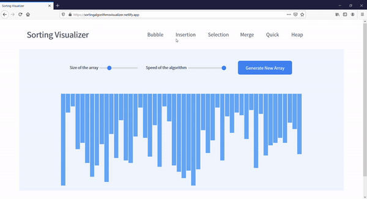

# Sorting visualizer

A visualizer built using **HTML, CSS and vanilla JS** which visualizes various sorting algorithms

#### Check out the live demo [here](https://sortingalgorithmsvisualizer.netlify.app/)

## 
### 

## Sorting Algorithms visualized
1. Bubble sort
2. Insertion sort
3. Selection sort
4. Merge sort
5. Quick sort
6. Heap

##
## [Live Demo](https://sortingalgorithmsvisualizer.netlify.app/)
